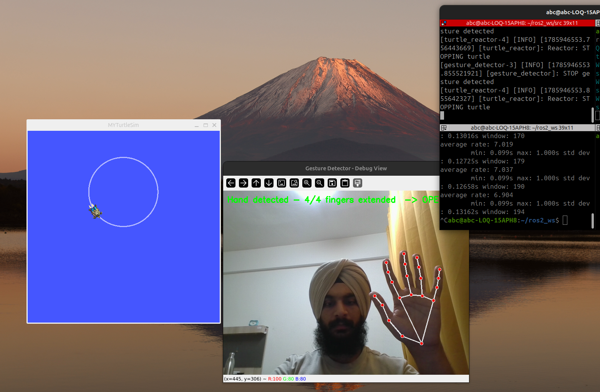
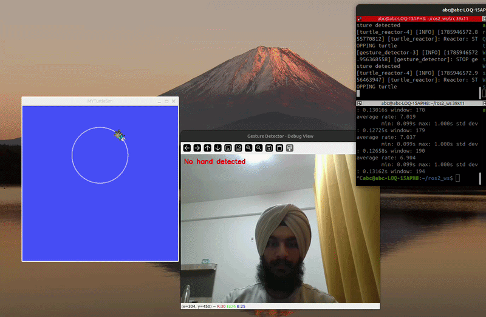
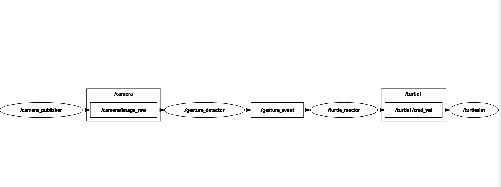

 ROS 2 Vision-Triggered Safety Stop System

A modular ROS 2 (Jazzy) system demonstrating real-time computer vision integration with robot velocity control. The system processes live video feeds to detect hand gestures and immediately triggers an emergency stop sequence on a simulated robot actor.


---

## System Overview & Demonstration

# Demonstration


```
[ Webcam ] ──(OpenCV)──> [ camera_publisher ]
                              │
                    Topic: /camera/image_raw (sensor_msgs/msg/Image)
                              ▼
                       [ gesture_detector ]
                              │  (MediaPipe Hand Landmark Detection)
                    Topic: /gesture_event (std_msgs/msg/Bool)
                              ▼
                       [ turtle_reactor ]
                              │
                    Topic: /turtle1/cmd_vel (geometry_msgs/msg/Twist)
                              ▼
                        [ Turtlesim ]
```

### Architecture Graph (`rqt_graph`)



---

## Node Responsibilities

* **`camera_publisher`**: Captures video frames from the webcam using OpenCV, formats them into `bgr8` raw image messages, and publishes streams to `/camera/image_raw`.
* **`gesture_detector`**: Subscribes to `/camera/image_raw`, converts ROS image streams via `cv_bridge`, tracks 21 3D hand keypoints with MediaPipe, and evaluates extended fingers to output boolean safety states on `/gesture_event`.
* **`turtle_reactor`**: Subscribes to `/gesture_event`. When a safety stop (open palm) is recognized, it overrides active motion inputs and publishes zero-velocity `Twist` messages to `/turtle1/cmd_vel`.

---

## Runtime Terminal Logs

### Node Launch Output
```text
[INFO] [launch]: All log files can be found below /home/abc/.ros/log/
[INFO] [launch]: Default logging verbosity is set to INFO
[INFO] [turtlesim_node-1]: process started with pid [12065]
[INFO] [camera_publisher-2]: process started with pid [12066]
[INFO] [gesture_detector-3]: process started with pid [12067]
[INFO] [turtle_reactor-4]: process started with pid [12068]
[INFO] [turtlesim_node-1]: Starting turtlesim with node name /turtlesim
[gesture_detector-3]: INFO: Created TensorFlow Lite XNNPACK delegate for CPU.
[camera_publisher-2]: Publishing camera stream on /camera/image_raw [30 FPS]
[gesture_detector-3]: Gesture Detector initialized. Subscribed to /camera/image_raw
[turtle_reactor-4]: Turtle Reactor listening on /gesture_event
```

### Safety Event Logs
```text
[gesture_detector-3]: [GESTURE DETECTED] Open Palm recognized. Publishing: /gesture_event -> True
[turtle_reactor-4]:   [EMERGENCY STOP] Safety override active! Overriding /cmd_vel to linear: 0.0, angular: 0.0
[gesture_detector-3]: [GESTURE RELEASED] Default state. Publishing: /gesture_event -> False
[turtle_reactor-4]:   [SYSTEM NOMINAL] Resuming normal motion commands.
```

---

## Prerequisites & Dependencies

* **Operating System**: Ubuntu 24.04 LTS
* **ROS Distribution**: ROS 2 Jazzy Jalisco
* **Python Target**: Python 3.12

### Python Package Environment
To ensure ABI compatibility with ROS 2 `cv_bridge` C++ wrappers, install the required Python libraries using NumPy 1.x ABI pinning:

```bash
pip install "numpy<2" "opencv-contrib-python<4.10" "scipy<1.14" mediapipe --break-system-packages
```

---

## Build & Installation

1. **Clone the repository into your ROS 2 workspace `src` directory:**
   ```bash
   cd ~/ros2_ws/src
   git clone https://github.com/jsinghgithub/gesture-safety-stop.git
   ```

2. **Build the workspace:**
   ```bash
   cd ~/ros2_ws
   colcon build --packages-select gesture_safety_stop
   ```

3. **Source the environment:**
   ```bash
   source install/setup.bash
   ```

---

## Execution & Diagnostics

Launch the full multi-node system using the unified launch file:

```bash
ros2 launch gesture_safety_stop gesture_demo.launch.py
```

### Verification Commands
```bash
# Verify publication frequency of camera frames (~30 Hz)
ros2 topic hz /camera/image_raw

# Inspect real-time safety events
ros2 topic echo /gesture_event
```

---

## Key Technical Highlights

* **Decoupled Architecture**: Demonstrates modular ROS 2 design principles where vision processing, hardware drivers, and actuation logic run as isolated, resilient nodes.
* **Bridge Processing**: Integrates OpenCV matrices into ROS 2 `sensor_msgs/msg/Image` types using optimized `cv_bridge` conversions.
* **Fail-Safe Logic**: Designed around safety-critical stopping mechanisms for autonomous mobility platforms.
